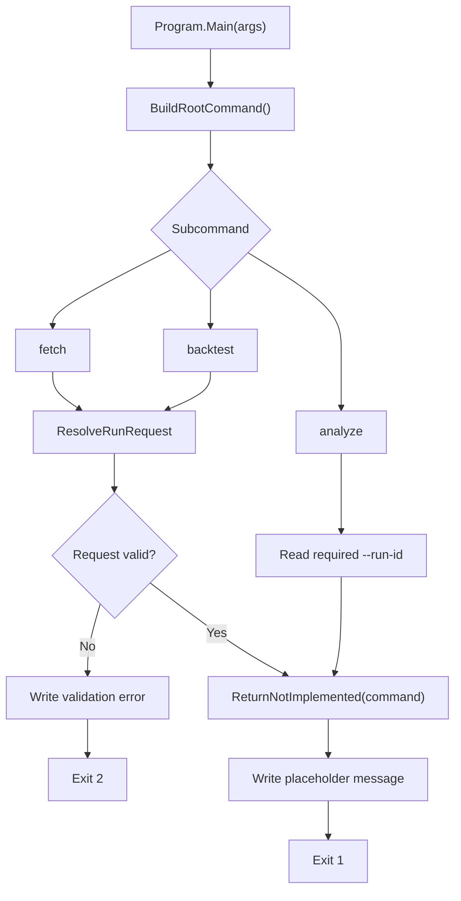
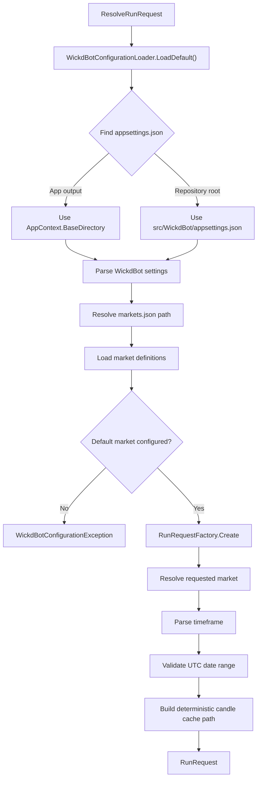
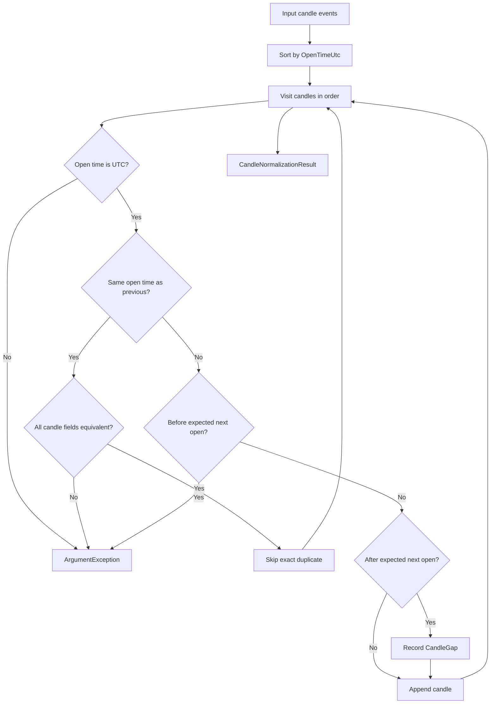
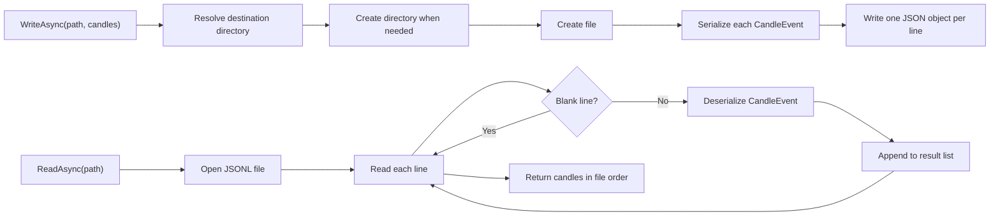

# Programmatic Business Flows

These diagrams show the currently implemented WickdBot program paths. Placeholder commands are shown as placeholders, not future behavior.

## CLI Command Flow

## Configuration And Run Request Flow

## Candle Normalization Flow

## JSONL Candle Cache Flow

## Related API Reference

- <xref:WickdBot.Program>
- <xref:WickdBot.Infrastructure.WickdBotConfigurationLoader>
- <xref:WickdBot.Infrastructure.RunRequestFactory>
- <xref:WickdBot.Data.CandleNormalizer>
- <xref:WickdBot.Data.CandleJsonLines>
