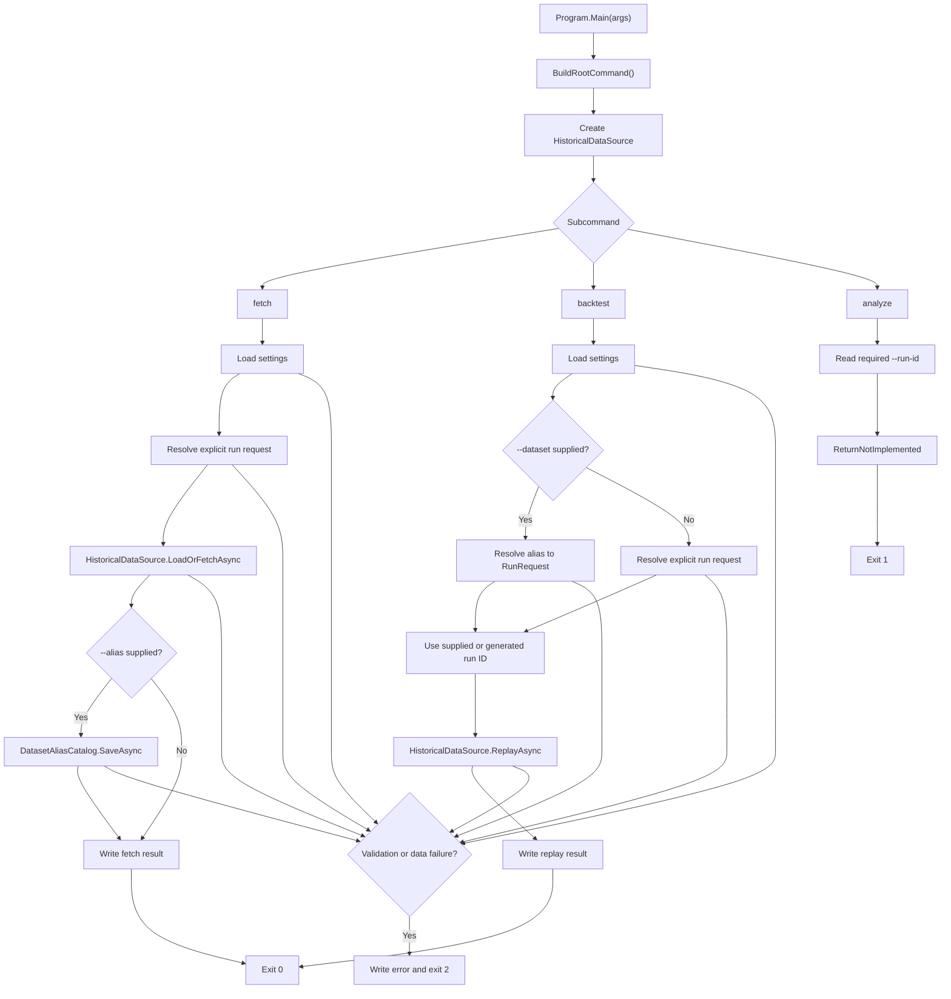
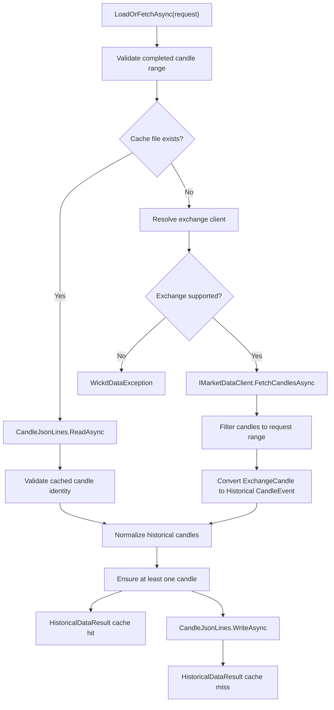
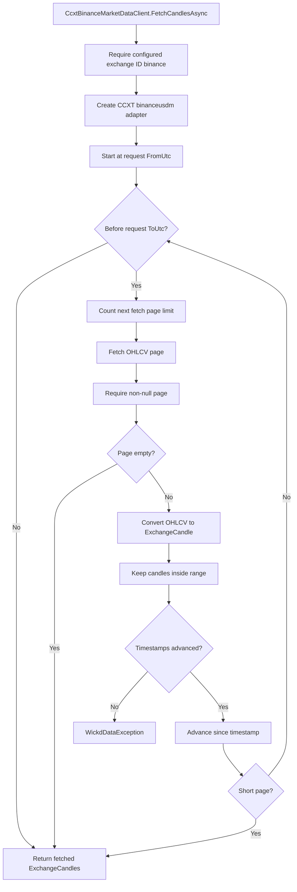
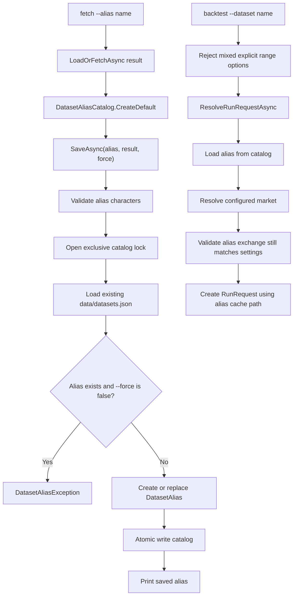
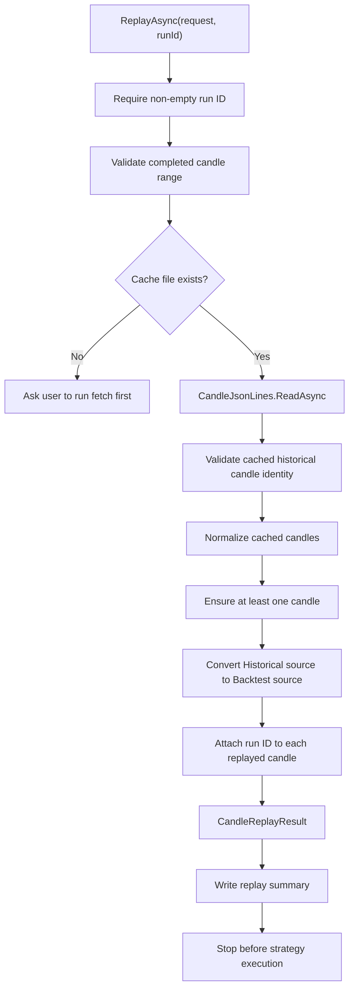
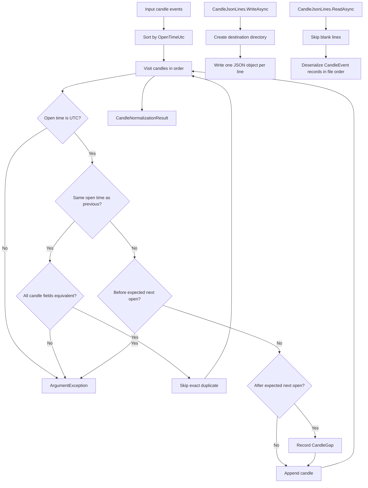

# Programmatic Business Flows

These diagrams show the currently implemented Wickd program paths. Phase 2 implements historical fetch, deterministic candle caching, dataset aliases, and cached candle replay. Strategy execution and analysis are still placeholders.

## CLI Command Flow

## Historical Fetch And Cache Flow

## Binance CCXT Fetch Flow

## Dataset Alias Flow

## Backtest Replay Flow

## Normalization And JSONL Flow

## Related API Reference

- <xref:Wickd.Program>
- <xref:Wickd.Data.HistoricalDataSource>
- <xref:Wickd.Data.IMarketDataClient>
- <xref:Wickd.Data.CcxtBinanceMarketDataClient>
- <xref:Wickd.Data.HistoricalDataResult>
- <xref:Wickd.Data.CandleReplayResult>
- <xref:Wickd.Data.DatasetAliasCatalog>
- <xref:Wickd.Data.DatasetAlias>
- <xref:Wickd.Data.CandleNormalizer>
- <xref:Wickd.Data.CandleJsonLines>
- <xref:Wickd.Infrastructure.RunRequestFactory>
